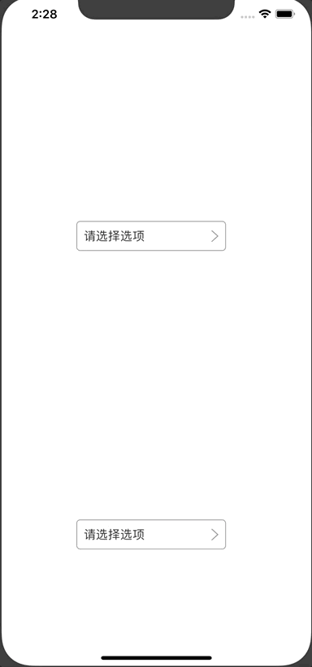

# JJOptionView
自己封装了一个简单的下拉列表控件




iOS封装的下拉列表控件，会自动识别向上向下展开

```
JJOptionView *view = [[JJOptionView alloc] initWithFrame:CGRectMake(100, 700, 200, 40)];
view.dataSource = @[@"111",@"222",@"333",@"444",@"555"];
view.selectedBlock = ^(JJOptionView * _Nonnull optionView, NSInteger selectedIndex) {
NSLog(@"%@",optionView);
NSLog(@"%ld",selectedIndex);
};
[self.view addSubview:view];


JJOptionView *view1 = [[JJOptionView alloc] initWithFrame:CGRectMake(100, 300, 200, 40)];
view1.dataSource = @[@"1",@"2",@"3",@"4",@"5"];
view1.delegate = self;
[self.view addSubview:view1];
```

```
JJSearchOptionView *view = [[JJSearchOptionView alloc] initWithFrame:CGRectMake(100, 700, 200, 40)];
view.dataSource = @[@"1",@"22",@"213",@"432",@"462",@"872",@"298",@"245",@"20",@"20567"];
view.selectedBlock = ^(JJSearchOptionView * _Nonnull optionView, NSString * _Nonnull selctedString, NSInteger selectedIndex) {

};
[self.view addSubview:view];

JJSearchOptionView *view1 = [[JJSearchOptionView alloc] initWithFrame:CGRectMake(100, 300, 200, 40)];
view1.dataSource = @[@"1",@"22",@"213",@"432",@"462",@"872",@"298",@"245",@"20",@"20567"];
view1.selectedBlock = ^(JJSearchOptionView * _Nonnull optionView, NSString * _Nonnull selctedString, NSInteger selectedIndex) {

};
[self.view addSubview:view1];
```


